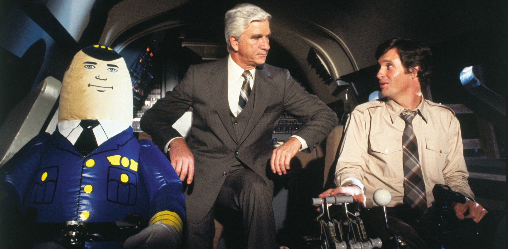
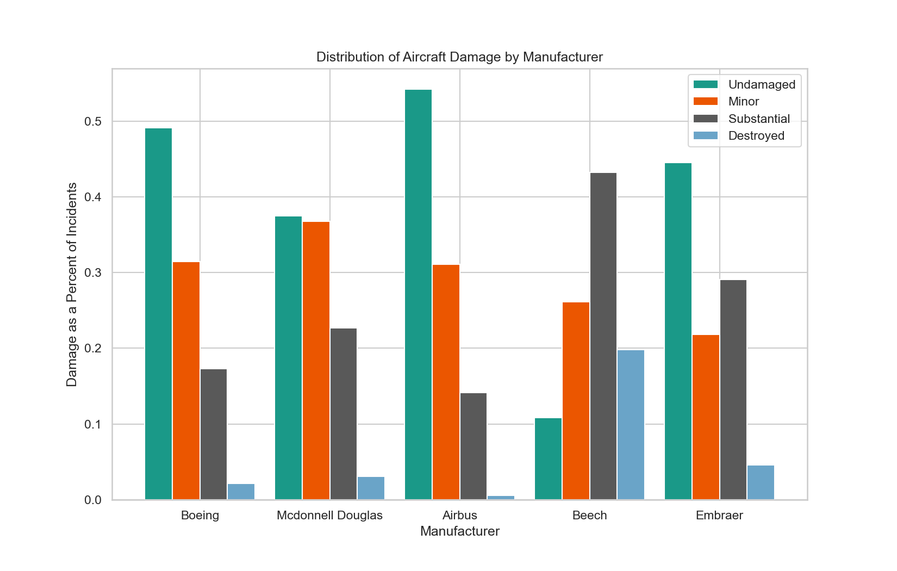
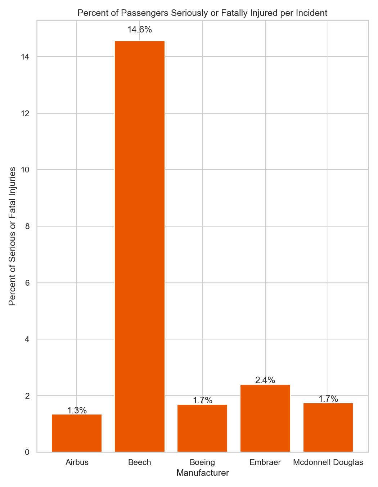
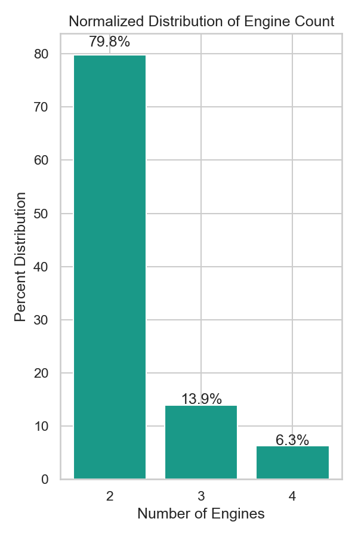
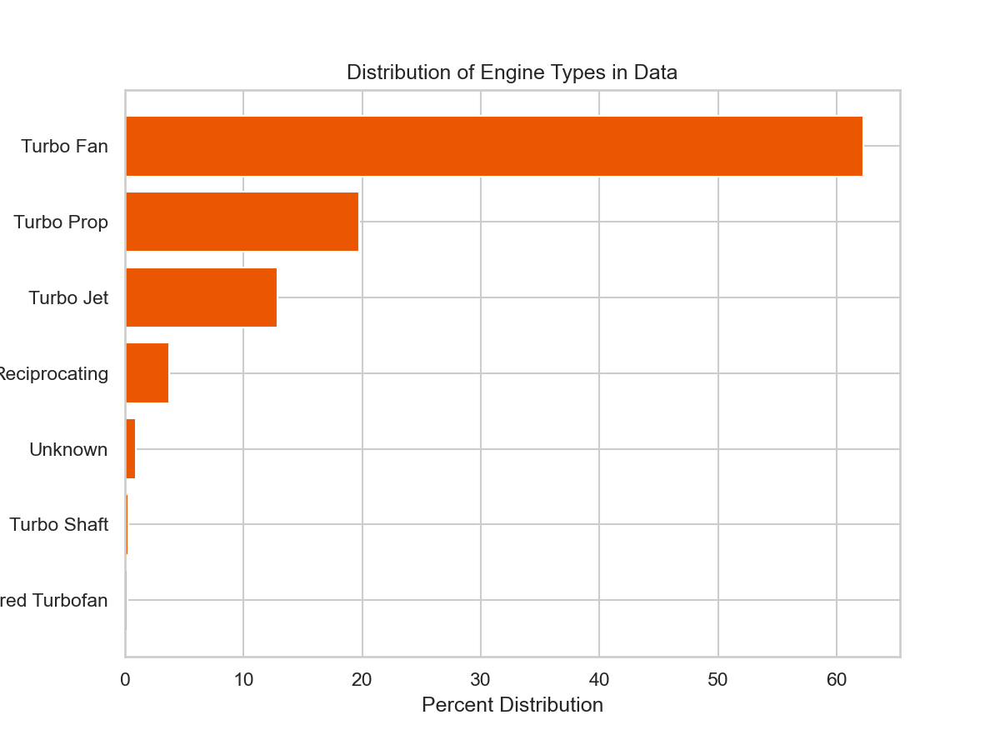

# Aviation Data Project

**"Don't Call Me Shirley"**

**Authors**: [Rachel Goldstein](mailto:rachelhgoldstein1@gmail.com), [Nick Kai](mailto:nhknicholas@gmail.com), [Tristan Trechsel](mailto:tristantrechsel@gmail.com)

## Overview

This project analyzes [data](https://www.kaggle.com/datasets/khsamaha/aviation-accident-database-synopses) from the National Transportation Safety Board on flight incidents and accidents in the United States since 1962. A descriptive analysis points to some manufacturers having less severe accidents as a proportion of total accidents. Our company can use this information to make a more informed decision about which aircraft to invest in.

## Business Problem


Our company intends to begin operating airplanes for commerical and private enterprise. Being unfamiliar with the risk involved with different airplanes, the new division head needs to know what manufacturers to steer clear of and what they can feel confident investing in.

## Data

The National Transportation Safety Board maintains records of all investigations into aircraft incidents and accidents in the United States since 1962. Each event has a unique ID associated with it. The data contains various information about the aircraft involved in the event, as well as the severity of the incident by numbers and types of injuries.

## Methods

This project uses a variety of data cleaning methods to organize and subset the data such as: 
- Dropping irrelevant properties.
- Filling in null values.
- Slicing, dicing, and filtering. 
- Created new columns to analyze injury severity and aircraft damage severity by manufacturer.
  
## Results

Beech planes are more likely to sustain heavy aircraft damage in an accident, whereas Airbus planes are more likely to be undamaged. 


If you are a passenger on a Beech plane, there is a 14% chance of sustaining a serious or fatal injury in an accident. Airbus planes have the lowest rate of a severe injury at 1.3%.
<p float="left">
   
  
</p>

The dataset is mainly made up of planes with twin turbo fan engines.
<p float="left">
   
  
</p>

## Conclusions

We can make three recommendations to the division head based on our analysis:

- **Buy Airbus planes!** Based on the data we have, incidents involving Airbus planes least often result in serious or fatal injury, and rarely lead to expensive aircraft damage. While incidents may be unavoidable over the long term as an operator of airplanes, they don't have to be catastrophic.
- **Or at least, don't buy Beech!** If Airbus planes are found to be too expensive, look for Boeing or Embraer, but whatever you do, DON'T buy a plane from Beech. Based on our data, 14% of all passengers involved in an incident on a Beech plane were seriously or fatally injured. 
- **And definitely make sure to buy a twin engine turbo fan!** If our dataset is at all indicative of the real world, we know that the vast majority of planes used to transport more than 10 passengers are twin engine turbo fans. At the very least, because of their prevalence, they are likely to be the easiest to maintain and service. Let's stick to the script here.
  

### Next Steps

We are left with a few more questions to pursue in the coming months.

- **What is the actual incidence level of an accident in the whole of air travel?** We only have data on records of unsuccessful flights, so we have no way of knowing just how common accidents are across manufacturers or engine types.
- **What is the most profitable airplane to operate?** As we consider which type of plane to operate and for what purpose, we will want to gather much more information to forecast profitability for different business plans. We know that devastating accidents are costly, so we have learned something about this already, but the whole picture is much more broad than that. We need to research pricing across commercial travel and private chartering, fuel efficiency of engine types, fuel costs, route needs, leasing/purchasing costs for different models, the list goes on.
- **Why are twin engine turbo fans the most common?** Are they fuel efficient? Are they the safest? It's clear that these engines dominate the market, but should we accept this at face value? Or is there an advantage to going against the grain?

## For More Information

See the full analysis in the [Jupyter Notebook](./Aviation_Data_Project_Notebook.ipynb) or review this [presentation](./Animal_Shelter_Needs_Presentation.pdf).

For additional info, contact Rachel Goldstein at [rachelhgoldstein1@gmail.com](mailto:rachelhgoldstein1@gmail.com), Nick Kai at [nhknicholas@gmail.com](mailto:nhknicholas@gmail.com), or Tristan Trechsel at [tristantrechsel@gmail.com](mailto:tristantrechsel@gmail.com).


## Repository Structure

```
├── code
│   ├── .DS_Store
│   ├── data_preparation.py
│   ├── visualizations.py
│   └── eda_notebook.ipynb
├── data
│   ├── Aviation_Data.csv
│   ├── Aviation_Data_Cleaned.csv
│   ├── Aviation_Data_Cleaned_v2.csv
│   └── Aviation_Data_Cleaned_v3.csv
├── images
├── .gitignore
├── Aviation_Data_Project_Notebook.ipynb
├── README.md
├── student.ipynb.pdf
└── Presentation.pdf
```
